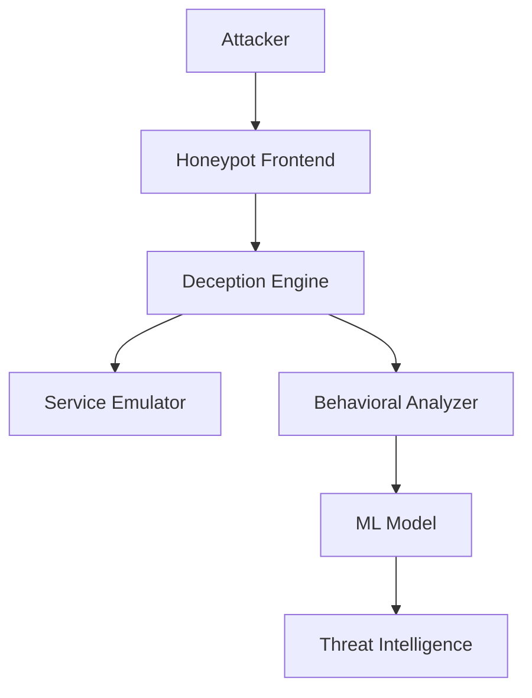

# 🎯 Adaptive AI Honeypot System

[](https://www.python.org/)
[](LICENSE)
[](CONTRIBUTING.md)
[](https://github.com/Varunpoojari/adaptive-ai-honeypot/issues)

<div align="center">
  
</div>

## 📋 Table of Contents
- [Overview](#-overview)
- [Key Features](#-key-features)
- [Architecture](#-architecture)
- [Installation](#-installation)
- [Usage](#-usage)
- [Security Considerations](#-security-considerations)
- [Contributing](#-contributing)
- [Documentation](#-documentation)
- [License](#-license)

## 🔍 Overview

The Adaptive AI Honeypot System is an advanced cybersecurity tool that leverages machine learning and artificial intelligence to create a dynamic, self-learning honeypot environment. By utilizing reinforcement learning and behavioral analysis, the system adapts its responses based on attacker interactions, making it an effective tool for threat intelligence gathering and attack pattern analysis.

### What Makes It Different?
- **Adaptive Responses**: Unlike traditional static honeypots, our system learns and evolves.
- **Real-time Analysis**: Continuous monitoring and analysis of attacker behavior.
- **Intelligent Deception**: Dynamic service emulation that adapts to attack patterns.

## 🚀 Key Features

### Core Capabilities
- **Dynamic Service Emulation**
  - Configurable port listening
  - Service behavior mimicking
  - Adaptive response generation

### Machine Learning Components
- **Behavioral Analysis Engine**
  - Pattern recognition
  - Attack classification
  - Anomaly detection

### Security Features
- **Isolated Environment**
  - Containerized services
  - Resource limitation
  - Access control

### Monitoring & Analysis
- **Real-time Monitoring**
  - Traffic analysis
  - Attack visualization
  - Alert generation

## 🏗 Architecture



## 💻 Installation

### Prerequisites
- Python 3.8+
- Docker
- Virtual Environment

### Step-by-Step Setup
1. **Clone the Repository**
   ```bash
   git clone https://github.com/Varunpoojari/adaptive-ai-honeypot.git
   cd adaptive-ai-honeypot
   ```

2. **Create Virtual Environment**
   ```bash
   python3 -m venv venv
   source venv/bin/activate  # On Windows: venv\Scripts\activate
   ```

3. **Install Dependencies**
   ```bash
   pip install -r requirements.txt
   ```

## 🎮 Usage

### Basic Operation
```bash
# Start the honeypot
PYTHONPATH=$PYTHONPATH:. python3 src/core/honeypot.py

# Monitor logs
tail -f logs/honeypot_*.log
```

### Advanced Configuration
Edit `config.yaml` to customize:
- Port configurations
- Service behaviors
- Logging options
- ML model parameters

## 🛡 Security Considerations

⚠️ **Important Warnings**:
- Never expose the honeypot directly to the internet
- Always run in a controlled environment
- Regularly monitor system resources
- Keep all dependencies updated

## 🤝 Contributing

We welcome contributions! Please see our [Contributing Guidelines](CONTRIBUTING.md) for details on:
- Code style
- Development process
- Pull request process

## 📚 Documentation

Detailed documentation is available in the [docs](docs/) directory:
- [Technical Overview](docs/technical-overview.md)
- [API Reference](docs/api-reference.md)
- [Deployment Guide](docs/deployment.md)

## 📝 License

This project is licensed under the MIT License - see the [LICENSE](LICENSE) file for details.

---

<div align="center">
  <b>Stay Secure, Stay Vigilant!</b>
</div>
