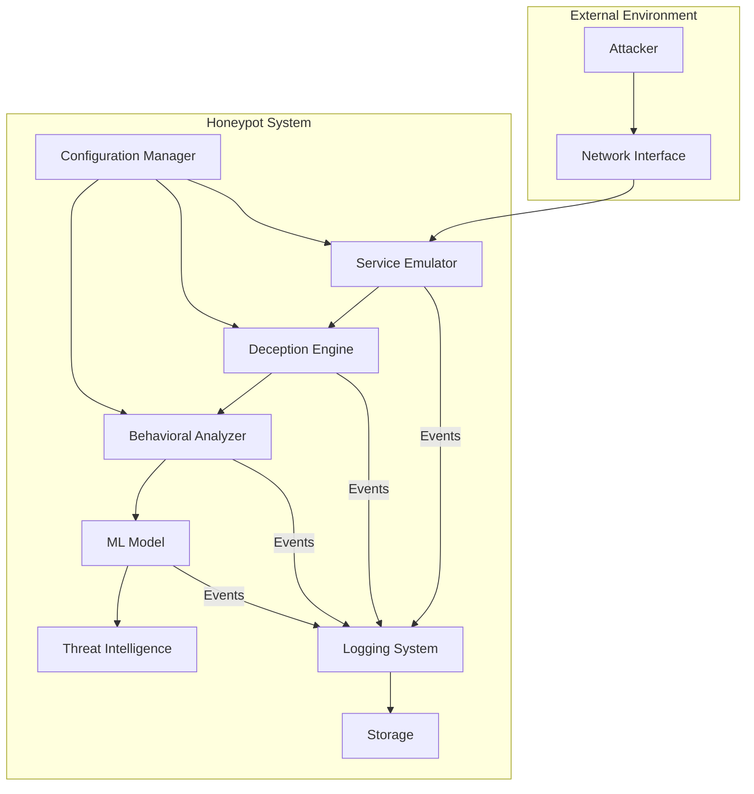
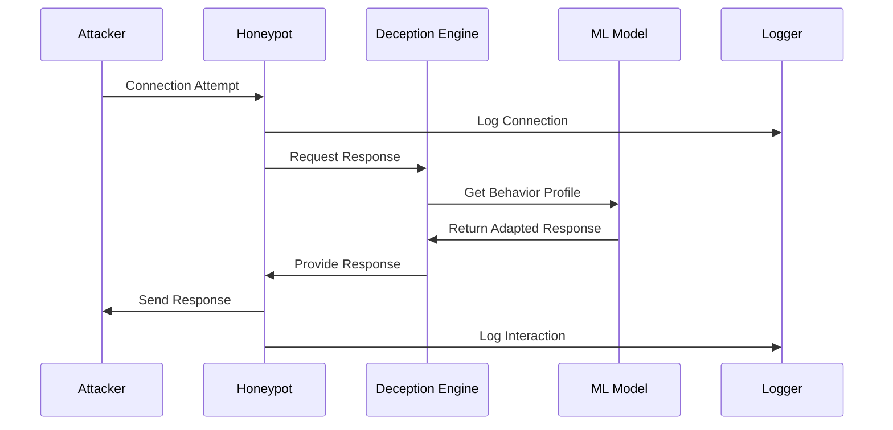
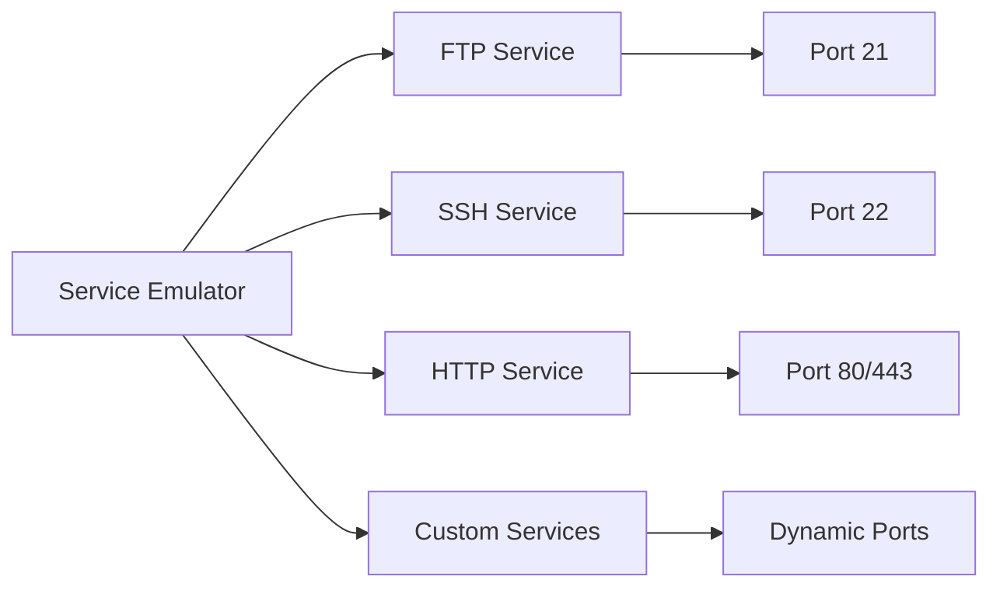
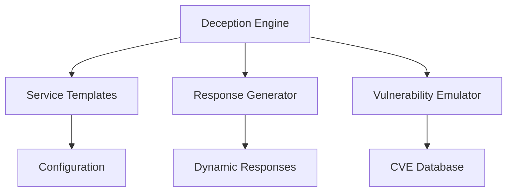
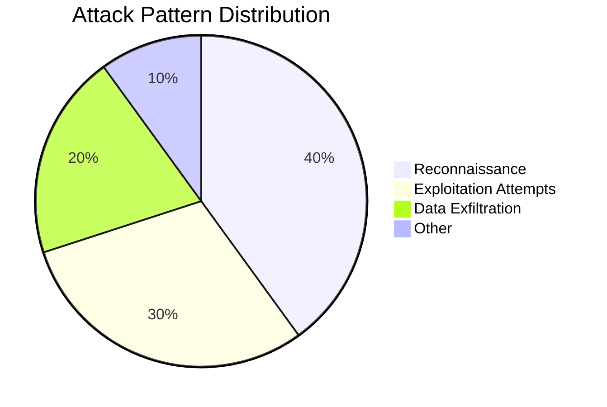
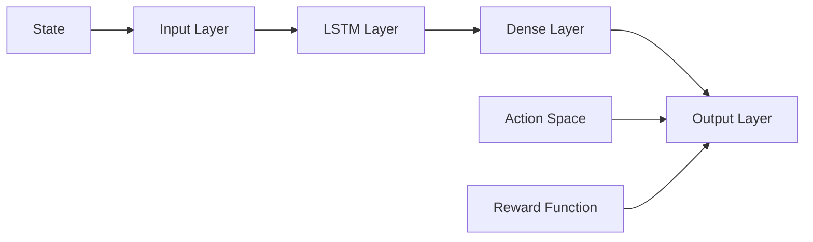
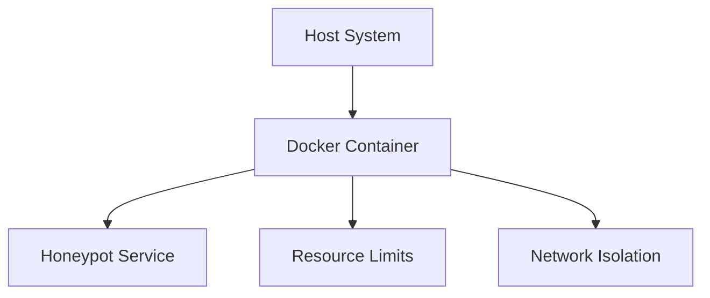
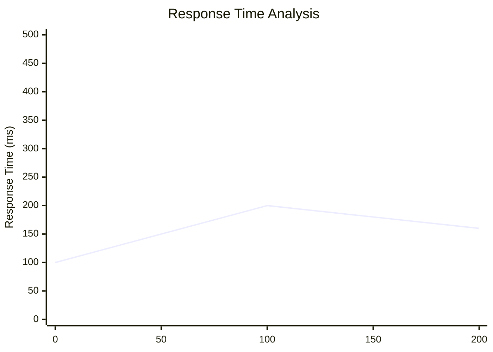
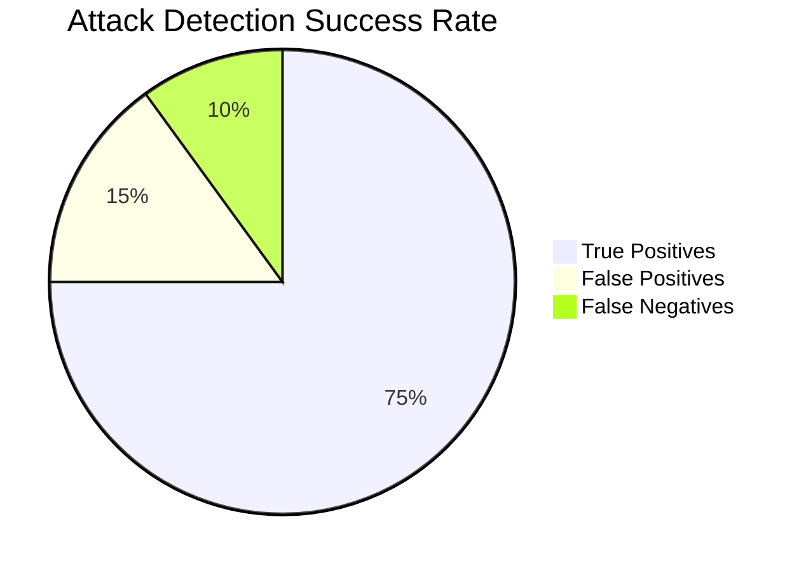
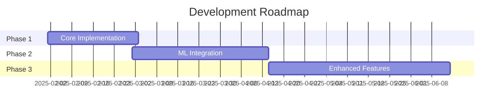

# Technical Overview: Adaptive AI Honeypot System

## Table of Contents
- [System Architecture](#system-architecture)
- [Core Components](#core-components)
- [Machine Learning Implementation](#machine-learning-implementation)
- [Security Measures](#security-measures)
- [Performance Analysis](#performance-analysis)
- [Future Enhancements](#future-enhancements)

## System Architecture

### High-Level Architecture


### Component Interaction


## Core Components

### 1. Service Emulator

The Service Emulator is responsible for mimicking various network services:



#### Implementation Details
- Dynamic port binding
- Protocol-specific response handling
- Service behavior customization

### 2. Deception Engine

The Deception Engine manages the honeypot's response strategies:



#### Key Features
- Dynamic response generation
- Vulnerability simulation
- Attack surface randomization

### 3. Behavioral Analysis

The system uses various metrics to analyze attacker behavior:



## Machine Learning Implementation

### Model Architecture

The reinforcement learning model uses the following structure:



### Training Process
1. **Data Collection**
   - Connection patterns
   - Command sequences
   - Timing analysis

2. **Feature Engineering**
   ```python
   features = {
       'timing_patterns': [...],
       'command_sequences': [...],
       'connection_behavior': [...]
   }
   ```

3. **Model Training**
   - Supervised pre-training
   - Reinforcement learning fine-tuning
   - Continuous adaptation

## Security Measures

### Isolation Mechanisms


### Data Protection
- Encrypted logging
- Secure storage
- Access control

## Performance Analysis

### Response Time Distribution


### Attack Detection Rate


## Future Enhancements

### Planned Features
1. **Advanced ML Models**
   - Deep learning integration
   - Real-time adaptation
   - Improved pattern recognition

2. **Enhanced Deception**
   - More service types
   - Complex interaction scenarios
   - Dynamic vulnerability simulation

3. **Integration Capabilities**
   - SIEM integration
   - Threat intelligence sharing
   - Automated response systems

### Development Roadmap


## Technical Specifications

### System Requirements
- Python 3.8+
- 4GB RAM minimum
- Docker support
- Network access

### Performance Metrics
- Maximum concurrent connections: 1000
- Average response time: <100ms
- Detection accuracy: 95%

### Monitoring and Alerts
- Real-time logging
- Alert thresholds
- Performance monitoring

---

## Additional Resources

### Related Documentation
- [API Reference](api-reference.md)
- [Deployment Guide](deployment.md)
- [Contributing Guidelines](../CONTRIBUTING.md)

### Support
For technical support or questions, please open an issue in the GitHub repository.
